# Using obsidian

I've created this Obsidian vault as a variation on the sort of vault I use everyday. It takes a few steps to set up (mostly settings to turn on), but once set up allows for very fast access to references, easy note-taking and easy discoverability within your notes. If you tag things well enough you should be able to find references/notes easily when you need them. You should also be able to take notes quickly in a format that makes them easy to find when you need them (sometimes without really looking!).

To use this vault to its full potential you will need to enable the Zotero integrations:

- Install the [betterBibtex plugin](https://github.com/retorquere/zotero-better-bibtex/releases) for Zotero.

Export your library (or a folder if you'd rather):
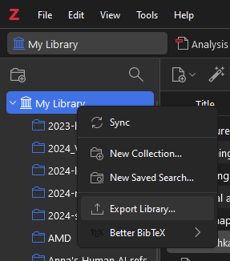

Select Better CSL JSON and "Keep updated":

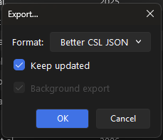

Call it "export.json" and save it into your vault folder:

This will allow us to import data from zotero! If we go to the Citations plugin settings we can enter our filename for our exported references, and our folder to store our notes.

You can then paste the contents of the "journal-article-template" file into the template section of the "Citations plugin":

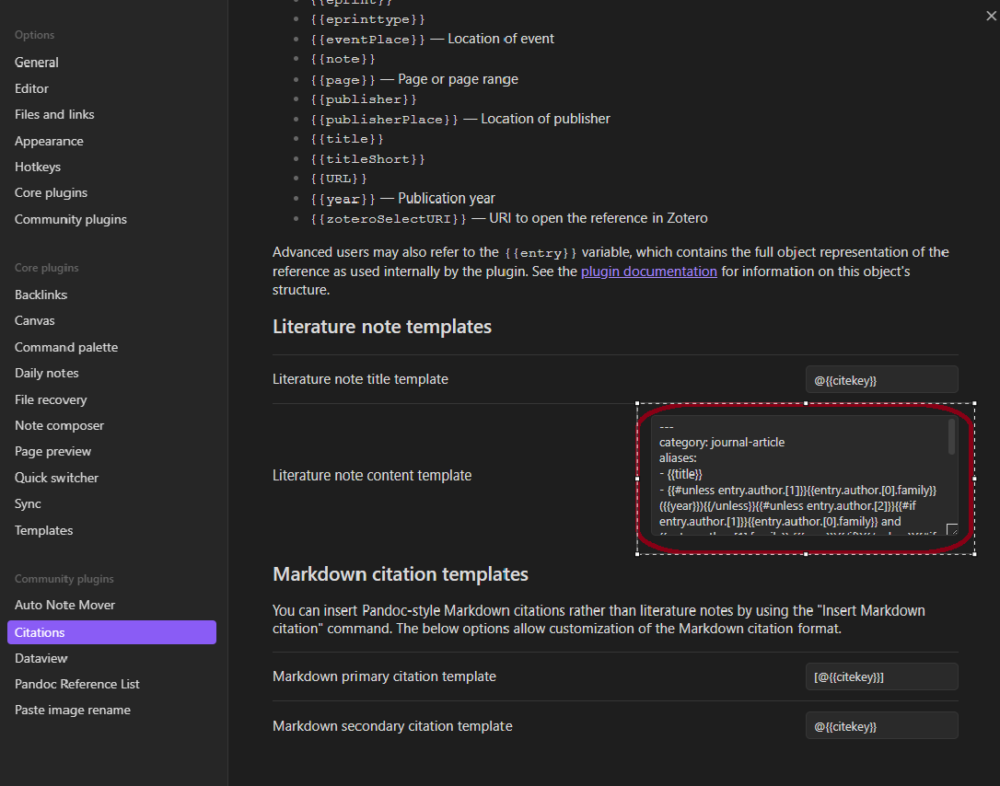

Once this is done we can go back to the command palette and type "Open literature note" to bring up a search bar:

From there you can search for something in your zotero (this search algorithm is pretty fiddly though!):

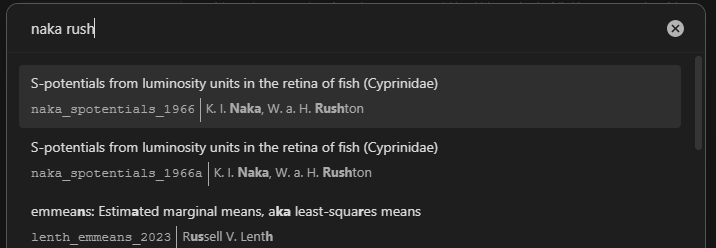

Once that is done you should end up with a note filled in using information from Zotero:

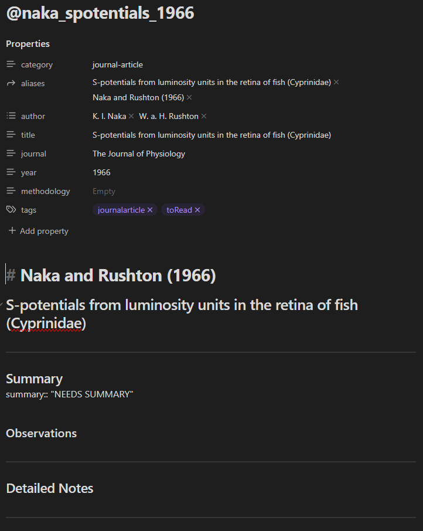

You can fill this in if you'd like. Some of the fields can be used in various ways.

First we need to set a templates folder. We'll set it to "templates" because that's where our templates are:
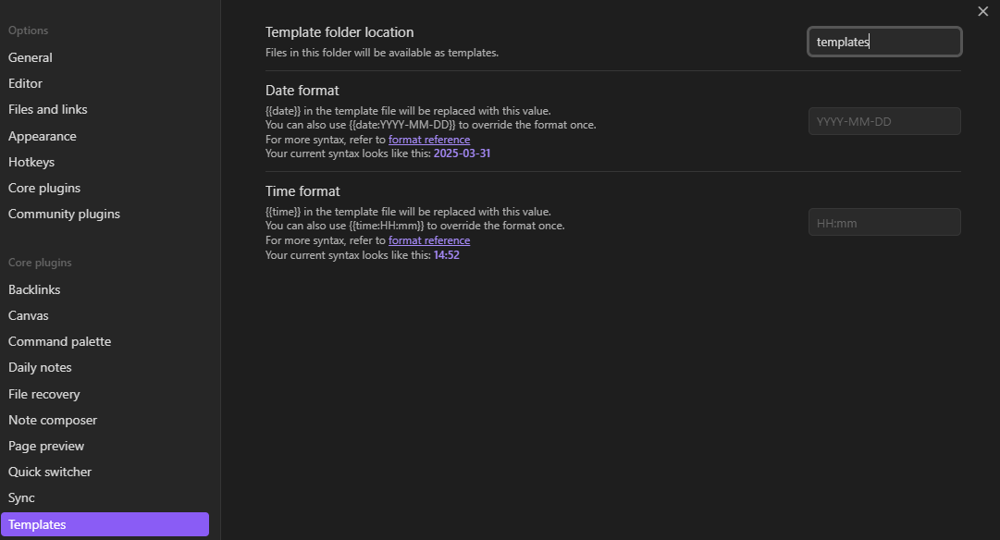

If we click on the journal that the article is from it will send us to a blank page. If we go back to the command palette and type "insert template" we can insert a template that will fill in all of the papers we have found from that journal:

We can do the same thing for the authors:

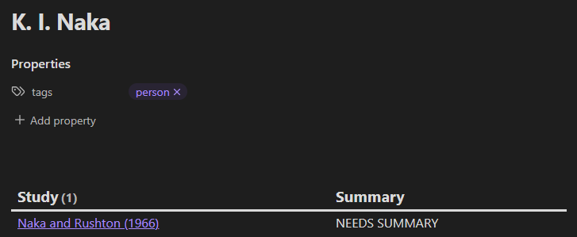

We can do this arbitrarily by any metadata (either in the header—like the authors or in the text—like the summary). What this means is that as we take notes, most of the connections are made for us. We can then setup systems of queries and views that can be helpful in synthesising information. Templates mean that we really only have to do the heavy lifting once. Once this system is set up, it makes for an easy way of creating multiple contextual windows to look at the information you're synthesising. It also means that everything remains connected to a citation. Once you start coming up with your own relevant fields (e.g., you can add numeric metadata—effect sizes, sample sizes etc.) or tags (topic-based, project based etc.) you can quickly add articles that you see in your email for example to a connected database, with prompts for why you were interested in that article. If you tag it properly, it will appear in contexts that you deem relevant without having to search for it!

## Pandoc Reference List

This plugin creates a really handy reference list that can let you see formatted citations and easily include references (once it is set up).

Make sure Zotero is open and hit "Pull bibliography from Zotero" and "Show citekey suggestions":

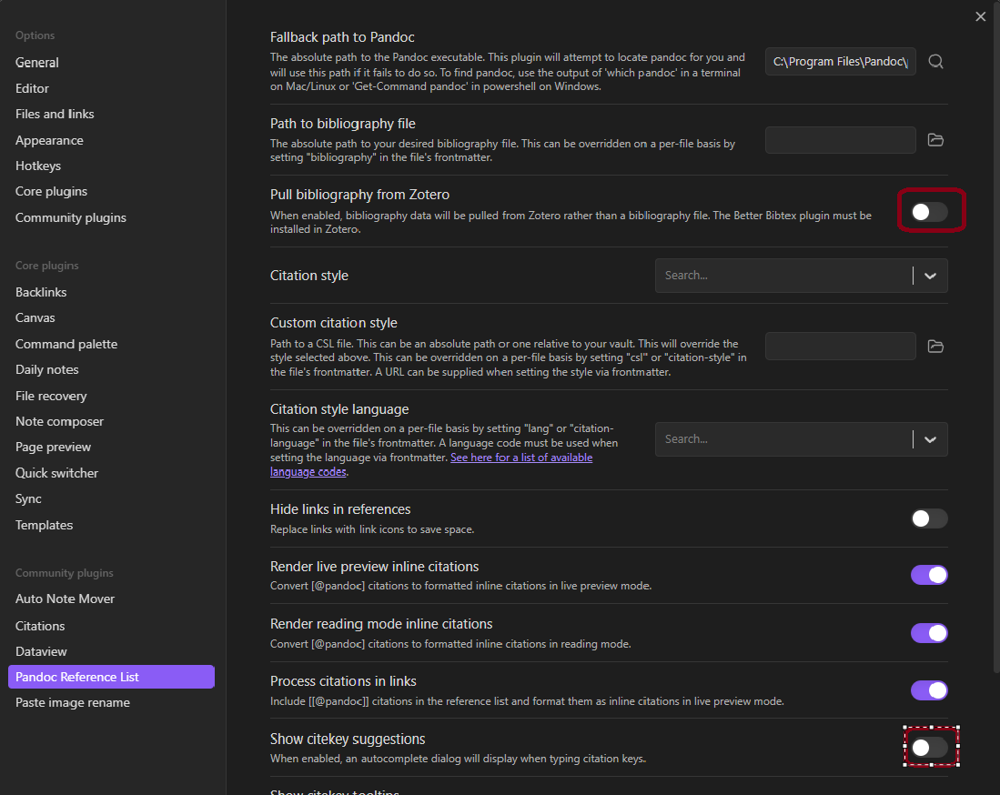

You can also choose your preferred citation style!

Once that is done you should get a list of suggestions when you start typing @... if not, make sure the directory where "pandoc.exe" is set correctly @naka_spotentials_1966\. Sometimes citations work weirdly if they have extra characters around them: " or . are particularly annoying. You can 'escape' them with a single backslash '\\\'.

If you go to the command palette on the sidebar:

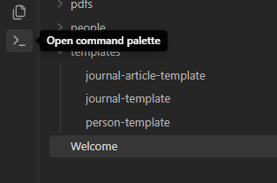

you can type in "pandoc reference list" to show a list of citations in the current document:

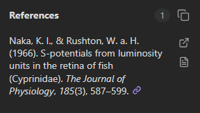

You can click on this to copy a citation and then paste it into your document:

Naka, K. I., & Rushton, W. a. H. (1966). S-potentials from luminosity units in the retina of fish (Cyprinidae). _The Journal of Physiology_, _185_(3), 587–599. [https://doi.org/10.1113/jphysiol.1966.sp008003](https://doi.org/10.1113/jphysiol.1966.sp008003)

You can also access the entry in Zotero or attached pdf!

If you made a note for this entry that is there too:

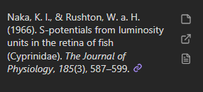

---
